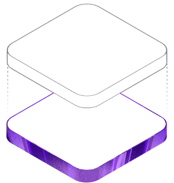
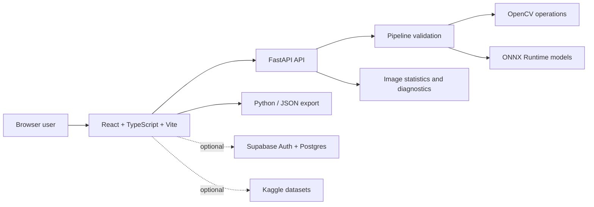

<div align="center">



# V-Rush

### An interactive workbench for reproducible computer-vision pipelines

Build, inspect, compare, and export image-processing experiments from the browser.
V-Rush brings classical OpenCV operations, ONNX inference, feature matching, and
visual diagnostics into one research-oriented workspace.

<p>
  <a href="https://github.com/BASSAT-BASSAT/V_Rush">Repository</a> ·
  <a href="https://doi.org/10.5281/zenodo.23137374">Concept DOI</a> ·
  <a href="https://doi.org/10.5281/zenodo.23137477">v0.2.2 DOI</a> ·
  <a href="https://orcid.org/0009-0006-3917-1319">ORCID</a>
</p>

[](https://doi.org/10.5281/zenodo.23137374)
[](LICENSE)
[](frontend/)
[](backend/)

**Authors:** Mohamed ElBassat · Rokayya Aly · Seifeldin Elkerdany

</div>

## What is V-Rush?

V-Rush is a browser-based computer-vision laboratory for the part of the workflow
that usually gets buried under boilerplate:

1. Load an image.
2. Compose an ordered sequence of operations.
3. Run the pipeline and inspect the result.
4. Compare the original and transformed images.
5. Examine histograms, statistics, detections, and warnings.
6. Export the experiment as Python or a JSON recipe.

It is designed for learning, rapid prototyping, research demonstrations, and
reproducible experimentation. The interface makes each transformation visible while
the FastAPI backend provides validated, server-side execution.

## Explore the application

### Studio — compose image pipelines

The Studio is a drag-and-drop workbench for stacking operations. It supports
classical image processing as well as optional model-backed operations.

<table>
  <tr>
    <td width="50%">
      <strong>Classical operations</strong><br>
      Intensity and color transforms, denoising, linear filters, edges, morphology,
      geometry, Fourier analysis, Gabor filters, texture descriptors, and segmentation.
    </td>
    <td width="50%">
      <strong>Model-backed operations</strong><br>
      YOLO26 object detection through ONNX Runtime and optional MobileSAM prompt-based
      segmentation, with clear runtime warnings when optional weights are unavailable.
    </td>
  </tr>
  <tr>
    <td>
      <strong>Visual diagnostics</strong><br>
      Before/after previews, grayscale and RGB histograms, image dimensions, mean,
      standard deviation, extrema, and pipeline warnings.
    </td>
    <td>
      <strong>Reproducible output</strong><br>
      Export a runnable Python pipeline using OpenCV, NumPy, and ONNX Runtime, or save
      the pipeline as a portable JSON recipe.
    </td>
  </tr>
</table>

### Matcher — compare two images

Drop in two images and compare them with local feature methods:

- SIFT
- ORB
- AKAZE
- BRISK
- BF or FLANN matching
- Lowe's ratio test
- RANSAC homography filtering

The matcher helps visualize which correspondences are geometrically consistent rather
than treating every descriptor match as reliable.

### Datasets and accounts

The optional application layer provides Supabase email authentication, profile data,
usage logging, and Kaggle dataset integration. These services are not required for
the core CV-only demo.

## Architecture



| Layer | Technology | Responsibility |
| --- | --- | --- |
| Web application | React, TypeScript, Vite, Motion | Workspace UI, pipeline editing, previews, charts, exports |
| API | FastAPI, Pydantic | Authentication boundary, input validation, image processing API |
| CV engine | OpenCV, NumPy | Classical operations, matching, statistics, encoding |
| Inference | ONNX Runtime | YOLO26 detection and optional MobileSAM segmentation |
| Persistence | Supabase Auth and Postgres | Optional accounts, profiles, and usage logging |

## Repository map

```text
V_Rush/
├── frontend/                 React + TypeScript application
│   └── src/
│       ├── components/       Studio, landing, controls, and visualizations
│       ├── cv/               Frontend operation metadata and export logic
│       ├── pages/             Studio, Matcher, Datasets, Profile, and Reference
│       └── lib/               Image, clipboard, auth, and export utilities
├── backend/                  FastAPI service and CV engine
│   ├── app/api/              Processing, matching, and dataset routes
│   ├── app/cv_ops/           Operation registry and implementations
│   ├── app/processing/       Image I/O, encoding, and statistics
│   └── tests/                Backend test suite
├── supabase/migrations/       Database schema and row-level security migrations
├── docs/                      Production and deployment documentation
├── CITATION.cff              Machine-readable citation metadata
├── .zenodo.json               Zenodo metadata
└── LICENSE                    MIT license
```

## Quick start

### Requirements

- Python 3.11+
- Node.js 20+
- npm
- `make` (or run the equivalent commands from the `Makefile`)

### Install

From the repository root:

```bash
make install
```

### Start the development services

Terminal 1 — API:

```bash
make run
```

Terminal 2 — frontend:

```bash
make run-frontend
```

Open <http://localhost:5173>.

### Fast local demo without Supabase

For a private/local CV-only demo:

1. Leave the frontend Supabase variables empty.
2. Run the backend with `KERNELLAB_AUTH_DISABLED=1`.
3. Keep the deployment private; this mode disables API authentication.

For authenticated local development, copy the example environment files and configure
Supabase:

```powershell
Copy-Item backend\.env.example backend\.env
Copy-Item frontend\.env.example frontend\.env
```

Never commit the resulting `.env` files. They are ignored by Git.

## Configuration and deployment

V-Rush can be deployed as:

- A single Vercel project using the repository-root `vercel.json`
- A Vercel frontend with the API on Render, Railway, or Fly.io
- A single Docker container using [`Dockerfile`](Dockerfile)
- A separate backend container using [`Dockerfile.backend`](Dockerfile.backend)

Important production settings include:

| Variable | Purpose |
| --- | --- |
| `VITE_API_BASE_URL` | Frontend API origin; leave empty for same-origin deployment |
| `VITE_SUPABASE_URL` | Public Supabase project URL |
| `VITE_SUPABASE_ANON_KEY` | Public Supabase anonymous key |
| `SUPABASE_JWT_SECRET` | Backend token verification secret; server-side only |
| `CORS_ORIGINS` | Comma-separated frontend origins allowed by the API |
| `KERNELLAB_AUTH_DISABLED` | Local/demo-only switch to disable API auth |
| `MAX_IMAGE_BYTES` | Maximum uploaded image size |
| `MAX_IMAGE_DIMENSION` | Maximum image width or height |

See [`docs/PRODUCTION-CHECKLIST.md`](docs/PRODUCTION-CHECKLIST.md) for Supabase
migrations, authentication URLs, CORS, Vercel, and external API deployment.

## Models and licensing

The repository includes `backend/yolo26n.onnx` for the YOLO26 operation. MobileSAM
encoder and decoder files are optional because of their size; follow
[`backend/scripts/export_mobile_sam.py`](backend/scripts/export_mobile_sam.py) before
enabling MobileSAM in a deployment.

V-Rush source code and documentation are released under the MIT License. Third-party
libraries, model weights, datasets, and generated assets may have separate licenses.
Review upstream terms before redistribution or commercial use. V-Rush does not claim
ownership of third-party model weights.

## Testing and quality checks

Run the backend tests:

```bash
make test
```

Run the backend linter:

```bash
make lint
```

Build and lint the frontend:

```bash
cd frontend
npm run build
npm run lint
```

## Citation

If you use V-Rush, cite the archived release you used. The current release is
`v0.2.2`:

```bibtex
@software{elbassat2026vrush,
  author  = {ElBassat, Mohamed and Aly, Rokayya and Elkerdany, Seifeldin},
  title   = {V-Rush: An Interactive Computer-Vision Workbench},
  year    = {2026},
  version = {0.2.2},
  url     = {https://github.com/BASSAT-BASSAT/V_Rush},
  doi     = {10.5281/zenodo.23137477}
}
```

- **Exact release DOI:** [10.5281/zenodo.23137477](https://doi.org/10.5281/zenodo.23137477)
- **Project concept DOI:** [10.5281/zenodo.23137374](https://doi.org/10.5281/zenodo.23137374)
- **ORCID:** [0009-0006-3917-1319](https://orcid.org/0009-0006-3917-1319)
- **Google Scholar:** [Mohamed ElBassat](https://scholar.google.com/citations?user=cHdwvRsAAAAJ&hl=en)

The version DOI identifies the exact archived release. The concept DOI groups the
V-Rush release history. See [`CITATION.cff`](CITATION.cff) for machine-readable
metadata.

## Project status and limitations

V-Rush is an active research and prototyping project. Supported operations, interfaces,
deployment behavior, and model availability may change between releases. Results from
model-backed operations depend on the included model, runtime, input image, and
parameters; they should not be treated as a benchmark or a production guarantee
without independent evaluation.

## Contributing

Issues and pull requests are welcome. Please include:

- Reproducible steps
- Expected and actual behavior
- Relevant operation parameters
- Sample inputs only when redistribution is permitted

Do not commit credentials, `.env` files, private datasets, personal documents, or
proprietary model weights.

## License

The V-Rush source code is available under the [MIT License](LICENSE). This license
applies to the project code and documentation unless a file or dependency states
otherwise.
